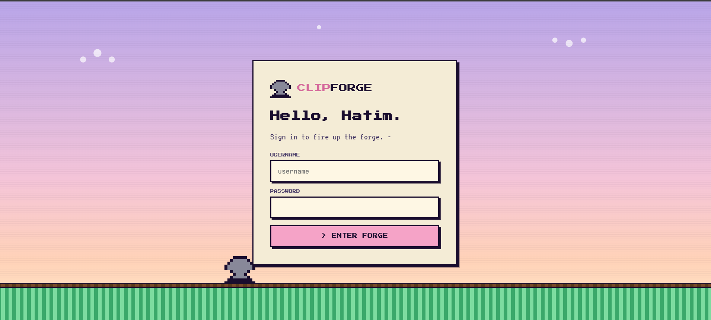

# ✂️ ClipForge



Turn any YouTube video into viral short-form clips — fully self-hosted.

AI identifies the highest-engagement moments, cuts the video, crops to 9:16, and burns TikTok-style word-by-word captions automatically.

## How It Works

```
┌─────────────────────────────────────┐
│         🎬  YouTube URL             │
└──────────────────┬──────────────────┘
                   │
          ╔════════▼════════╗
          ║   📥  DOWNLOAD  ║  yt-dlp — best quality video + audio
          ╚════════╤════════╝
                   │
          ╔════════▼════════╗
          ║   🔀  MERGE     ║  FFmpeg — combines streams into mp4
          ╚════════╤════════╝
                   │
          ╔════════▼════════╗
          ║  🎙  TRANSCRIBE ║  Groq Whisper (whisper-large-v3)
          ║                 ║  word-level timestamps · filters hallucinations
          ║                 ║  auto-chunks files > 20 MB
          ╚════════╤════════╝
                   │
          ╔════════▼════════╗
          ║  🧠  ANALYZE    ║  Groq Llama (llama-3.3-70b-versatile)
          ║                 ║  scores moments for virality
          ║                 ║  picks the best clips
          ╚════════╤════════╝
                   │
          ╔════════▼════════╗
          ║  ✂️   CLIP       ║  FFmpeg — smart 9:16 crop (face-tracking)
          ║                 ║  cuts clips · burns karaoke captions
          ╚════════╤════════╝
                   │
┌──────────────────▼──────────────────┐
│   🚀  Viral-ready shorts — upload   │
│       to TikTok · Reels · Shorts    │
└─────────────────────────────────────┘
```

## Requirements

- Python 3.10+, Node.js 18+, ffmpeg, yt-dlp
- A **Groq API key** — free tier at [console.groq.com](https://console.groq.com)
- Works on Ubuntu/Debian and Windows

## Setup

```bash
chmod +x setup.sh start.sh
bash setup.sh
```

Create a `.env` file in the project root:

```
GROQ_API_KEY=gsk_...
CLIP_USER=admin
CLIP_PASS=yourpassword
```

**Optional — use browser cookies instead of cookies.txt (recommended for servers):**
```
COOKIES_FROM_BROWSER=chromium
```
When set, yt-dlp reads live cookies directly from the browser profile — they never expire. If not set, falls back to a `cookies.txt` file at the repo root.

**Optional — YouTube upload integration:**
```
YOUTUBE_CLIENT_ID=...
YOUTUBE_CLIENT_SECRET=...
YOUTUBE_REDIRECT_URI=http://localhost:8000/api/youtube/callback
```

## Running

```bash
bash start.sh
```

Open `http://localhost:8000` and sign in with the `CLIP_USER` / `CLIP_PASS` you set.

## Output

Clips are saved to `output/<job-id>/` as `.mp4` files:
- Cropped to **9:16 vertical** format with smart face-tracking pan
- TikTok-style **word-by-word karaoke captions** burned in
- H.264 encoded, ready for direct upload

## Pipeline Stages

| Stage | What happens |
|---|---|
| DOWNLOAD | yt-dlp fetches best quality video + audio |
| MERGE | FFmpeg combines the streams into a single mp4 |
| TRANSCRIBE | Groq Whisper generates word-level timestamps |
| ANALYZE | Groq Llama scores each moment for virality |
| CLIP | FFmpeg cuts, crops, and burns captions |

## Troubleshooting

**yt-dlp fails:** `pip install -U yt-dlp`

**FFmpeg not found:** `sudo apt install ffmpeg` (Linux) or `winget install Gyan.FFmpeg` (Windows)

**Groq API error:** Check `GROQ_API_KEY` in your `.env`

**Login fails:** Make sure `CLIP_USER` and `CLIP_PASS` are set in `.env`
